# Machine Learning: A Comprehensive Guide 


By: Jacob Johnson

# Basics

## What is Machine Learning?

- Machine Learning is a type of learning where a machine can learn on its own without being explicitly programmed.
- “Machine learning is a branch of [artificial intelligence (AI)](https://www.ibm.com/cloud/learn/what-is-artificial-intelligence)  and computer science which focuses on the use of data and algorithms to imitate the way that humans learn, gradually improving its accuracy”. [https://www.ibm.com/cloud/learn/machine-learning](https://www.ibm.com/cloud/learn/machine-learning)

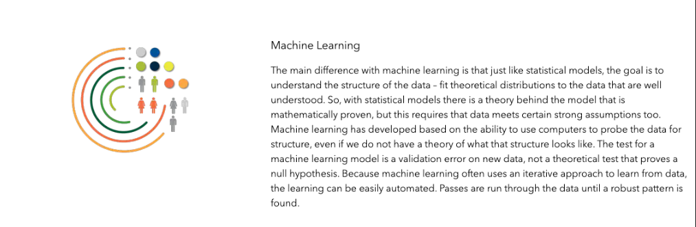

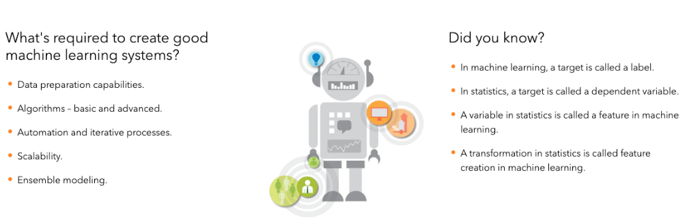

Source: [https://www.ibm.com/cloud/learn/machine-learning](https://www.ibm.com/cloud/learn/machine-learning)

---

**Sources/Reading Materials:**

[https://www.geeksforgeeks.org/difference-between-machine-learning-and-artificial-intelligence/](https://www.geeksforgeeks.org/difference-between-machine-learning-and-artificial-intelligence/)

[https://www.techtarget.com/searchenterpriseai/definition/machine-learning-ML](https://www.techtarget.com/searchenterpriseai/definition/machine-learning-ML)

[https://www.ibm.com/cloud/learn/machine-learning](https://www.ibm.com/cloud/learn/machine-learning)

[https://www.sas.com/en_us/insights/analytics/machine-learning.html](https://www.sas.com/en_us/insights/analytics/machine-learning.html)

---

# Supervised vs Unsupervised Learning

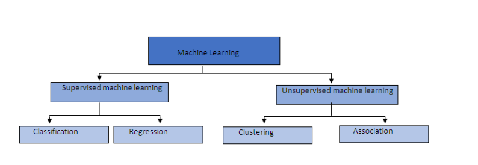

Source: [https://medium.com/quick-code/regression-versus-classification-machine-learning-whats-the-difference-345c56dd15f7](https://medium.com/quick-code/regression-versus-classification-machine-learning-whats-the-difference-345c56dd15f7)

- **Supervised Learning:** The training of a machine learning algorithm on labeled data.
    - The labeled data is typically represented by our designated y-variable also known as our target variable.
    - Our target is special because we are providing the machine learning algorithm with the correct answer. Allowing us to easily evaluate the model’s performance and tune the model’s hyperparameters with the intent of increasing the model’s performance.
    - Important Algorithms:
    - [K-Nearest Neighbors](https://towardsdatascience.com/machine-learning-basics-with-the-k-nearest-neighbors-algorithm-6a6e71d01761)
    - [Linear Regression](https://towardsdatascience.com/introduction-to-machine-learning-algorithms-linear-regression-14c4e325882a)
    - [Support Vector Machines (SVMs)](https://medium.com/analytics-vidhya/a-beginners-introduction-to-svm-c641c3ff2769)
    - [Decision Trees and Random Forests](https://towardsdatascience.com/decision-trees-and-random-forests-df0c3123f991)
    - [Neural Networks](https://www.datacamp.com/tutorial/deep-learning-python)
- **Unsupervised Learning:** The training of a machine learning algorithm on unlabeled data.
    - The algorithm is tasked with learning “on its own”. Typically we are attempting to find previously unexplained relationships in our data.
    - Important Algorithms:
        - Clustering
            - [K-Means](https://towardsdatascience.com/understanding-k-means-clustering-in-machine-learning-6a6e67336aa1)
            - [DBSCAN](https://towardsdatascience.com/how-dbscan-works-and-why-should-i-use-it-443b4a191c80)
            - [Hierarchical Cluster Analysis (HCA)](https://medium.com/@sametgirgin/hierarchical-clustering-model-in-5-steps-with-python-6c45087d4318)
        - [Anomaly detection and novelty detection](https://www.geeksforgeeks.org/machine-learning-for-anomaly-detection/)
        - Visualization and Dimensionality Reduction
            - [Principal Component Analysis (PCA)](https://towardsdatascience.com/a-one-stop-shop-for-principal-component-analysis-5582fb7e0a9c)
            - [t-Distributed Stochastic Neighbor Embedding (t-SNE)](https://builtin.com/data-science/tsne-python)
        - Associated rule learning
            - [Apriori](https://medium.com/edureka/apriori-algorithm-d7cc648d4f1e)
            - [Eclat](https://www.section.io/engineering-education/eclat-algorithm-in-python/)

**Sources/Reading Materials:**

---

[Hands-On Machine Learning with Scikit-Learn, Keras & TensorFlow 2nd Edition by Aurelien Geron](https://www.amazon.com/gp/product/1492032646/ref=dbs_a_def_rwt_hsch_vapi_tpbk_p1_i0)  (Chapter 1: The Machine Learning Landscape)

[https://www.geeksforgeeks.org/supervised-unsupervised-learning/](https://www.geeksforgeeks.org/supervised-unsupervised-learning/)

[https://www.ibm.com/cloud/blog/supervised-vs-unsupervised-learning](https://www.ibm.com/cloud/blog/supervised-vs-unsupervised-learning)

---

# Regression vs Classification

### Regression

- **Regression:** In machine learning we use regression algorithms when we are using independent variables to predict a numerical or continuous output.
- The most common method for fitting a regression line is the method of least-squares. This method calculates the best-fitting line for the observed data by minimizing the sum of the squares of the vertical deviations from each data point to the line
    
    Source: [http://www.stat.yale.edu/Courses/1997-98/101/linreg.htm](http://www.stat.yale.edu/Courses/1997-98/101/linreg.htm)
    

$$
Y = a + bX
$$

**Types of Regression**

- Simple Linear Regression
- Polynomial Regression
- Decision Tree Regression
- Random Forest Regression
- Support Vector Regression

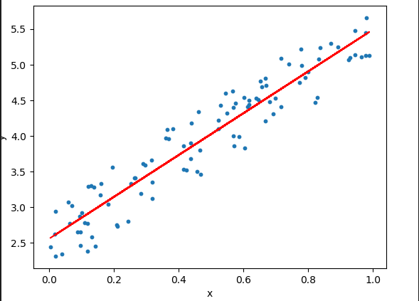

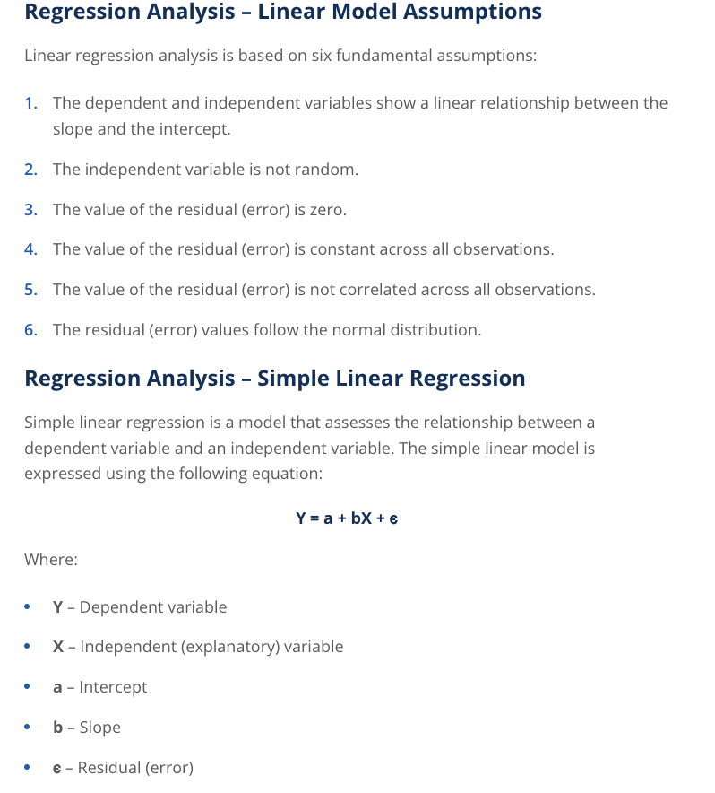

[https://corporatefinanceinstitute.com/resources/knowledge/finance/regression-analysis/](https://corporatefinanceinstitute.com/resources/knowledge/finance/regression-analysis/)

**Popular Regression Problems**

- House price prediction
- Stock prediction
- Market trends
- Weather patterns
- Sales forecasting
- Movie ratings
- ad clicks

---

## Gradient Descent

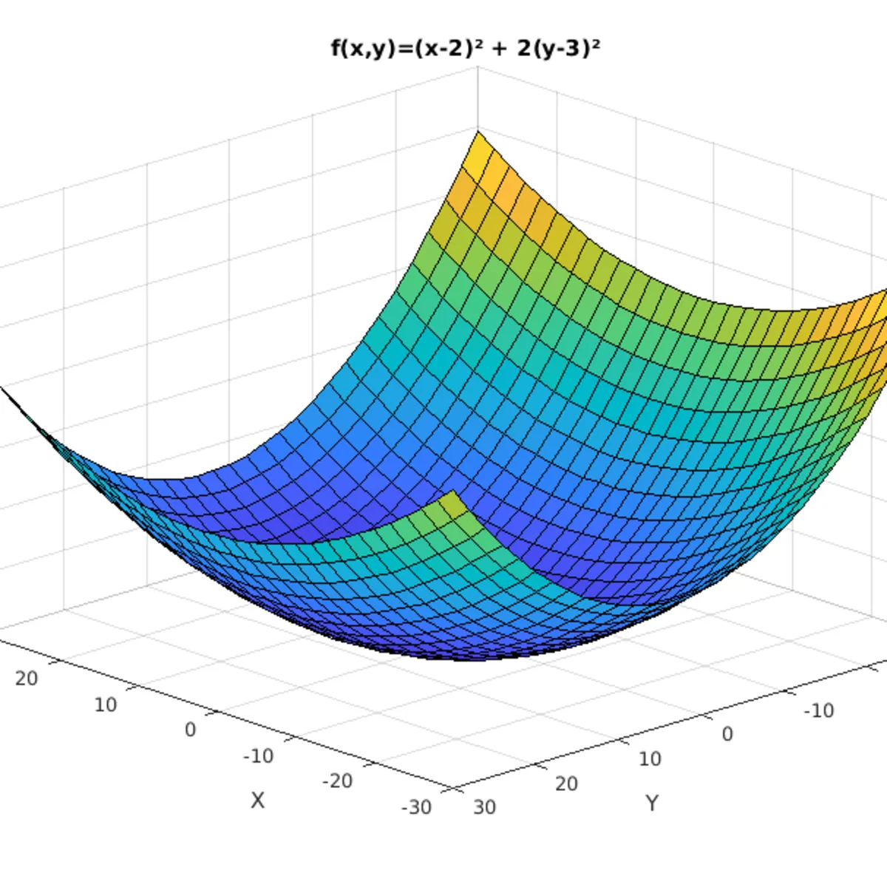

Source: [https://gdsc.community.dev/events/details/developer-student-clubs-sir-syed-university-of-engineering-and-technology-presents-gradient-descent/](https://gdsc.community.dev/events/details/developer-student-clubs-sir-syed-university-of-engineering-and-technology-presents-gradient-descent/)

One of the most fundamental concepts of machine learning is gradient descent.

********************Gradient Descent:******************** Gradient Descent is an optimization algorithm used to train many machine learning model by iteratively seeking to minimize the cost by adjusting the model’s parameters.

### What is a Gradient?

In mathematics a gradient is defined as a vector operand applied on a scalar function to produce a vector whose magnitude is the maximum derivative of the function at the point pointed in the direction of that maximum rate of change.

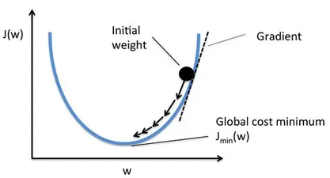

Source: [https://deepai.org/machine-learning-glossary-and-terms/stochastic-gradient-descent](https://deepai.org/machine-learning-glossary-and-terms/stochastic-gradient-descent)

### The Cost Function

The cost function or loss is the function that is to be minimized by the gradient. Its result allows us to understand the difference between the actual values and the predicted values of our model. Under the hood, the gradient descent algorithm attempts to optimize the cost function by minimizing the difference between the actual a predicted values by adjusting the model parameters. 

### Cost Function Formula: Squared error cost function

$$
J(f_w,_b) = \frac{1} {2m} {\sum\limits_{i = 0}^{m} ( \hat{y}^i - y^i)^2}   
$$

### Visualizing the cost function

$Model: f_w,_b(x) = wx + b$

$Parameters  : w,b$

$Cost Function : J(f_w,_b) = \frac{1} {2m} \sum\limits_{i = 0}^{m}(x^{(i)}- y^{(i)})^2$

$Objective : \frac{minimize} {w,b}(w,b)$

### Train the model with gradient descent

Gradient descent algorithm

$$
w = w - \alpha \frac{\partial }{\partial w} J(f_w,_b) 
$$

Here $\alpha$ is referred to as the learning rate. This controls how big the descent. 

$$
b = b - \alpha \frac{\partial }{\partial b} J(f_w,_b)
$$

Simultaneous update w and b. Repeat until convergence. 

Near a local minimum

- Derivative becomes smaller
- Update steps become smaller

Can reach minimum without decreasing learning rate $\alpha$

**Code Example: Gradient Descent**

```python
# Import Libraries
import numpy as np
import matplotlib.pyplot as plt
import seaborn as sns
plt.style.use('ggplot')
```

```python
# Define target and feature variables
X = 3 * np.random.rand(100, 1)
y = 4 + 2 * X + np.random.randn(100, 1)

b = np.random.random()  # bias
theta = np.random.randn(2, 1)  # weights
```

```python
# Plot relation between variables
def plot_reg():
    sns.regplot(x=X, y=y, color="g")
    plt.xlabel('x')
    plt.ylabel('y', rotation='horizontal')
    plt.title("Relationship between x and y")
    plt.savefig("Images/regression_plot.png")
    plt.show()

plot_reg()
```

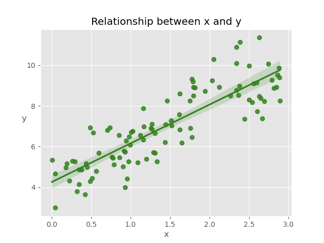

Source: Original Image

```python
# Define function to calculate the cost
def compute_cost(X, y, theta):
    """
    compute cost
    Args:
        X (ndarray (m,n)): Data, m examples with n features
        y (ndarray (m,)): target values
        theta (ndarray (n,)): model parameters
    Returns
        cost (scalar): cost
    """
    m = X.shape[0]
    predictions = X.dot(theta)
    cost = (1 / 2 * m) * np.sum(np.square(predictions - y))

    return cost
```

```python
# Create function to perform gradient descent algorithm
def gradient_descent(X, y, theta, learning_rate, iterations):
    """
    Computes the gradient for linear regression
    Args:
        X (ndarray (m, )): Data, m examples
        y (ndarray (m, )): target values
        theta  (scalar)    : model parameters
        learning_rate (scalar) : linear rate of our model
        iterations (scalr) : number of iterations
    Returns:
        Final theta vector and array of cost history over no of iterations
    """
    m = X.shape[0]

    loss_history = np.zeros(iterations)
    weight_history = np.zeros((iterations, 2))

    for i in range(iterations):
        prediction = np.dot(X, theta)
        theta = theta - (1 / m) * learning_rate * (X.T.dot((prediction - y)))
        weight_history[i, :] = theta.T
        loss_history[i] = compute_cost(X, y, theta)

    return loss_history, weight_history, theta
```

```python
# Instantiate model and create variables for tracking loss history
X_b = np.c_[np.ones((len(X), 1)), X]
cost_history, theta_history, theta = gradient_descent(X_b, y, theta, lr, iter)
```

```python
# Plot learning curve
def plot_loss():
    fig, ax = plt.subplots(figsize=(7, 5))
    ax.set_ylabel('Theta')
    ax.set_xlabel('Iterations')
    ax.plot(range(iter), cost_history, 'b.')
    ax.title.set_text('Learning Curve')
    plt.show()

plot_loss()
```

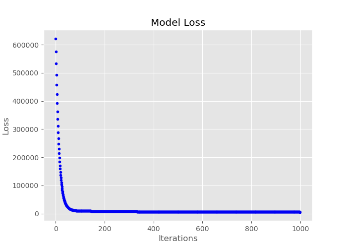

Source: Original Image

Click link for full code example:[https://github.com/JacobJ215/Machine-Learning-Guide/blob/main/Regression%20Code%20Examples/gradient_descent.py](https://github.com/JacobJ215/Machine-Learning-Guide/blob/main/Regression%20Code%20Examples/gradient_descent.py)

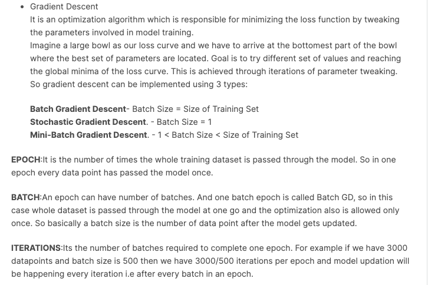

[https://www.kaggle.com/getting-started/193766](https://www.kaggle.com/getting-started/193766)

---

**********************Sources/Reading Materials**********************

[https://www.geeksforgeeks.org/gradient-descent-algorithm-and-its-variants/](https://www.geeksforgeeks.org/gradient-descent-algorithm-and-its-variants/)

[https://www.ibm.com/cloud/learn/gradient-descent](https://www.ibm.com/cloud/learn/gradient-descent)

[https://realpython.com/gradient-descent-algorithm-python/](https://realpython.com/gradient-descent-algorithm-python/)

[https://towardsdatascience.com/gradient-descent-algorithm-a-deep-dive-cf04e8115f21](https://towardsdatascience.com/gradient-descent-algorithm-a-deep-dive-cf04e8115f21)

[https://medium.com/@lachlanmiller_52885/machine-learning-week-1-cost-function-gradient-descent-and-univariate-linear-regression-8f5fe69815fd](https://medium.com/@lachlanmiller_52885/machine-learning-week-1-cost-function-gradient-descent-and-univariate-linear-regression-8f5fe69815fd)

---

# Regression Algorithms

### Stochastic Gradient Descent Regressor

SGD stands for Stochastic Gradient Descent: the gradient of the loss is estimated each sample at a time and the model is updated along the way with a decreasing strength schedule (aka learning rate).

 [https://ogrisel.github.io/scikit-learn.org/sklearn tutorial/modules/generated/sklearn.linear_model.SGDRegressor.html](https://ogrisel.github.io/scikit-learn.org/sklearn-tutorial/modules/generated/sklearn.linear_model.SGDRegressor.html)

The word ‘*stochastic*‘ means a process linked with random probability. Hence, in Stochastic Gradient Descent, a few samples are selected randomly instead of the whole data set for each iteration. In SGD, we find out the gradient of the cost function of a single example at each iteration instead of the sum of the gradient of the cost function of all the examples.

**Code Example: SGDRegressor**

```python
# Generate our target and features using the make_regression function
X, y = make_regression(n_samples=100, n_features=25)

# Split X and y into training and testing sets
X_train, X_test, y_train, y_test = train_test_split(X,
                                                    y,
                                                    test_size=0.2,
                                                    random_state=42)

# Scale data
scaler = StandardScaler()
X_train = scaler.fit_transform(X_train)
X_test = scaler.transform(X_test)
```

```python
# Instantiate model
model = SGDRegressor()

# Train the model
model.fit(X_train, y_train)

# Evaluate how well our model fits to the training set
score = model.score(X_train, y_train)
print(f"R-Squared: {score}")

# Predict on testing set
y_pred = model.predict(X_test)

# Calculate error and print results
mse = mean_squared_error(y_test, y_pred)
rmse = np.sqrt(mse)
print(f"RMSE: {rmse}")
```

```python
# Print intercept and coefficient
print(f"Intercept: {model.intercept_}")
print(f"Coefficient: {model.coef_}")
```

Click link for full code example: [https://github.com/JacobJ215/Machine-Learning-Guide/blob/main/Regression%20Code%20Examples/sgd_regressor.py](https://github.com/JacobJ215/Machine-Learning-Guide/blob/main/Regression%20Code%20Examples/sgd_regressor.py)

---

**************************************************Sources/Reading Materials**************************************************

[https://scikit-learn.org/stable/modules/generated/sklearn.linear_model.SGDRegressor.html#sklearn.linear_model.SGDRegressor](https://scikit-learn.org/stable/modules/generated/sklearn.linear_model.SGDRegressor.html#sklearn.linear_model.SGDRegressor)

[https://www.geeksforgeeks.org/ml-stochastic-gradient-descent-sgd/](https://www.geeksforgeeks.org/ml-stochastic-gradient-descent-sgd/)

[https://towardsdatascience.com/stochastic-gradient-descent-clearly-explained-53d239905d31](https://towardsdatascience.com/stochastic-gradient-descent-clearly-explained-53d239905d31)

[https://medium.com/@nikhilparmar9/simple-sgd-implementation-in-python-for-linear-regression-on-boston-housing-data-f63fcaaecfb1](https://medium.com/@nikhilparmar9/simple-sgd-implementation-in-python-for-linear-regression-on-boston-housing-data-f63fcaaecfb1)

[https://ogrisel.github.io/scikit-learn.org/sklearn-tutorial/modules/generated/sklearn.linear_model.SGDRegressor.html](https://ogrisel.github.io/scikit-learn.org/sklearn-tutorial/modules/generated/sklearn.linear_model.SGDRegressor.html)

---

### Linear Regression

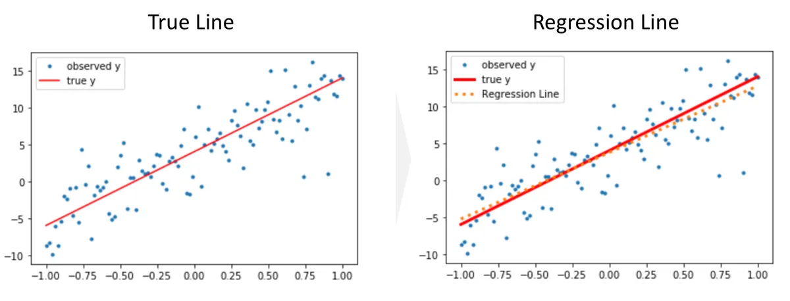

source: [https://h1ros.github.io/posts/linear-regression/](https://h1ros.github.io/posts/linear-regression/)

**The Linear Regression** model is used to find the relationship between one or more features and the continuous target variable. 

The objective of the Linear Regression algorithm is to obtain a line of best fit and this is done by minimizing the loss function.

$$
MSE = \frac{1} {n} {\sum\limits_{i = 1}^{n} (y_i -  \hat{y}_i )^2} = \frac{1} {n} {\sum\limits_{i = 1}^{n} (y_i -  (wx + b)^2}   
$$

************************************************************Linear Regression Assumptions:************************************************************

- **A linear relationship between features and the target variable**
- **Little or No Multicollinearity between features**
    - Multicollinearity occurs when the features are not independent of each other.
- **Little or No Autocorrelation in residuals**
    - Autocorrelation occurs when the residual errors are not independent of each other.
- **Homoscedasticity**
    - **Homoscedasticity** occurs when the variance of the error between the independent and dependent variables is the same across all independent variables
- **Normal distribution of error terms**

For an in depth explanation on Linear Regression Assumptions Please see: [https://medium.com/analytics-vidhya/understanding-linear-regression-in-depth-intuition-6c9f3b1cbb51](https://medium.com/analytics-vidhya/understanding-linear-regression-in-depth-intuition-6c9f3b1cbb51) 

[https://dataaspirant.com/assumptions-of-linear-regression-algorithm/](https://dataaspirant.com/assumptions-of-linear-regression-algorithm/)

[https://www.kdnuggets.com/2017/11/first-linear-regression-assumptions.html](https://www.kdnuggets.com/2017/11/first-linear-regression-assumptions.html)

---

**************************************************************Code Example: Linear Regression**************************************************************

```python
# Import libraries
import numpy as np
import matplotlib.pyplot as plt
from sklearn.model_selection import train_test_split
from sklearn.preprocessing import StandardScaler
from sklearn.linear_model import LinearRegression
from sklearn.metrics import mean_squared_error
```

```python
# Define X and y variables
X = 5 * np.random.rand(100, 1)
y = 4 - 2 * X + np.random.randn(100, 1)

# Split X and y into training and testing sets
X_train, X_test, y_train, y_test = train_test_split(X,
                                                    y,
                                                    test_size=0.2,
                                                    random_state=42)

# Scale data
scaler = StandardScaler()
X_train = scaler.fit_transform(X_train)
X_test = scaler.transform(X_test)
```

```python
# Instantiate model
model = LinearRegression()

# Train the model
model.fit(X_train, y_train)

# Evaluate how well our model fits to the training set
score = model.score(X_train, y_train)
print(f"R-Squared: {score}")

# Predict on testing set
y_pred = model.predict(X_test)

# Calculate error and print results
mse = mean_squared_error(y_test, y_pred)
rmse = np.sqrt(mse)
print(f"RMSE: {rmse}")
```

```python
# Plot residuals
def plot_residuals():
    plt.scatter(model.predict(X_train), model.predict(X_train) - y_train, color="green", s=10, label='Train data')
    plt.scatter(y_pred, y_pred - y_test, color="blue", s=10, label='Test data')
    plt.hlines(y=0, xmin=-20, xmax=20, linewidth=2)
    plt.legend(loc='upper right')
    plt.title("Residual errors")
    plt.savefig('Images/residual_plot.png')
    plt.show()

plot_residuals()
```

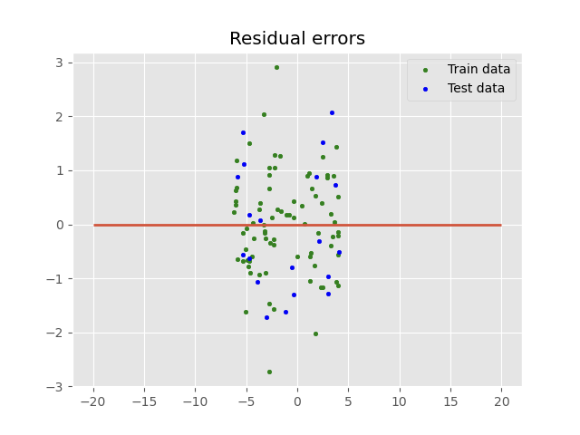

Source: Original Image

Click link for full code example: [https://github.com/JacobJ215/Machine-Learning-Guide/blob/main/Regression%20Code%20Examples/linear_regression.py](https://github.com/JacobJ215/Machine-Learning-Guide/blob/main/Regression%20Code%20Examples/linear_regression.py)

---

******Sources/Reading Materials******

[https://scikit-learn.org/stable/modules/generated/sklearn.linear_model.LinearRegression.html#sklearn.linear_model.LinearRegression](https://scikit-learn.org/stable/modules/generated/sklearn.linear_model.LinearRegression.html#sklearn.linear_model.LinearRegression)

[https://www.kdnuggets.com/2019/03/beginners-guide-linear-regression-python-scikit-learn.html](https://www.kdnuggets.com/2019/03/beginners-guide-linear-regression-python-scikit-learn.html)[https://jakevdp.github.io/PythonDataScienceHandbook/05.06-linear-regression.html](https://jakevdp.github.io/PythonDataScienceHandbook/05.06-linear-regression.html)

[https://medium.com/analytics-vidhya/understanding-linear-regression-in-depth-intuition-6c9f3b1cbb51](https://medium.com/analytics-vidhya/understanding-linear-regression-in-depth-intuition-6c9f3b1cbb51)

[https://towardsdatascience.com/linear-regression-detailed-view-ea73175f6e86](https://towardsdatascience.com/linear-regression-detailed-view-ea73175f6e86)

[https://www.geeksforgeeks.org/linear-regression-python-implementation/](https://www.geeksforgeeks.org/linear-regression-python-implementation/)

---

### Regularization

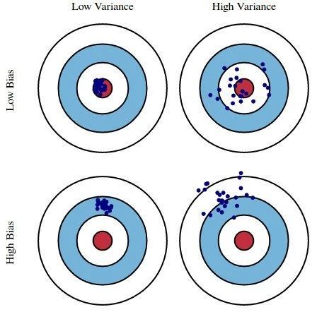

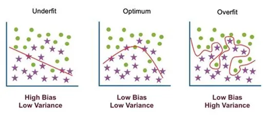

Source: [https://medium.com/mlearning-ai/understanding-overfitting-and-underfitting-in-layman-terms-e4c82a28e2d2](https://medium.com/mlearning-ai/understanding-overfitting-and-underfitting-in-layman-terms-e4c82a28e2d2) 

Source: [kdnuggets.com](http://kdnuggets.com/)

**Regularization** is a model constraining technique used to reduce the complexity of a model, this in turn prevents the model from overfitting. 

A model is said to be **overfit** when it performs well on the training set but and poorly or not at well on the testing set.

**Ridge**, **Lasso** and **ElasticNet** regression are regularization techniques to commonly used to reduce  and prevent over-fitting which may result from linear regression.

************Lasso Regression:************

$$
Lasso = {\sum\limits_{i = 1}^{n} (y_i -  {x}{_i}\hat\beta)^2} +  \lambda {\sum\limits_{j = 1}^{n} |\hat\beta^2_j|}   
$$

To reduce model complexity ******Lasso (least absolute shrinkage and selection operator) or L1 regularization****** adds a regularization term to the linear regression cost function. The regularized term is the L1 norm of the weight vector

An important characteristic of Lasso Regression is that it tends to completely eliminate the weights of the least important features (i.e., set them to zero). 

Lasso Regression automatically performs feature selection and outputs a sparse model (i.e., with few nonzero feature weights).

******************************Ridge Regression:******************************

$$
Ridge = {\sum\limits_{i = 1}^{n} (y_i -  {x}{_i}\hat\beta)^2} +  \lambda {\sum\limits_{j = 1}^{n} w_j\hat\beta^2_j}   
$$

Like Lasso, **Ridge** or L2 regularization  adds a regularization penalty term to the cost function  equivalent to square of the magnitude of the coefficients. Here our regularization term is of L2 norm. 

Instead of eliminating the least important features the Ridge Regression minimizes the weights assigned to each feature. 

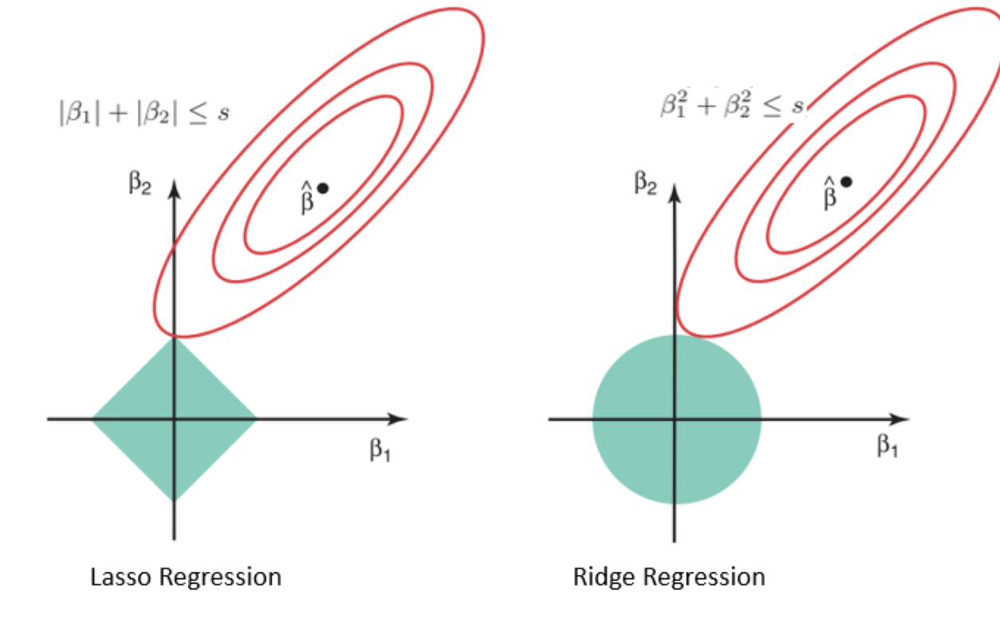

[https://online.stat.psu.edu/stat508/book/export/html/749](https://online.stat.psu.edu/stat508/book/export/html/749)

****Elastic Net Regression:****

****************Elastic Net Regression**************** is an application of both L1 and L2 regularization terms simultaneously applied to the cost function of linear regression. The hyperparameter **l1_ratio** defines how we mix  ****both L1 and L2 regularization.

$$
ElasticNet = {\sum\limits_{i = 1}^{n} (y_i -  {x}{_i}\hat\beta)^2} + \lambda {\sum\limits_{j = 1}^{n} |\hat\beta^2_j|}  +  \lambda {\sum\limits_{j = 1}^{n} w_j\hat\beta^2_j}   
$$

********************************************************Code Example: Regularization********************************************************

```python
# Import Libraries
import pandas as pd
import numpy as np
import seaborn as sns
import matplotlib.pyplot as plt
from sklearn.model_selection import train_test_split
from sklearn.linear_model import LinearRegression
from sklearn.linear_model import Ridge, Lasso, ElasticNet
from sklearn.preprocessing import StandardScaler
from sklearn.metrics import mean_squared_error

plt.style.use('ggplot')

# Read in data
df = pd.read_csv('Data/advertising_and_sales_clean.csv')
```

```python
# Select Target and Features
X = df.iloc[: , 1: 3].values
y = df["sales"].values

# Split data into training and testing
X_train, X_test, y_train, y_test = train_test_split(X,
                                                    y,
                                                    test_size=0.3,
                                                    random_state=42)

# Scale the data
scaler = StandardScaler()
X_train = scaler.fit_transform(X_train)
X_test = scaler.transform(X_test)
```

****************************************Lasso Regularization****************************************

```python
# Instantiate and Fit Lasso regression model 
lasso = Lasso(alpha = 10, random_state=42)
lasso.fit(X_train,y_train)

# Compute R-Squared for the Ridge Model
print("R-Squared: {:.3f}".format(ridge.score(X_train, y_train)))

# R-Squared 0.7517

# Make prediction
y_pred = lasso.predict(X_test)

# Compute mean_squared_error
mse = mean_squared_error(y_test, y_pred)

print("RMSE: ", np.sqrt(mse)) # RMSE:  45881.400342063855
```

****************************************Ridge Regularization****************************************

```python
# Instantiate and Fit Ridge regression model 
ridge = Ridge(alpha = 10, random_state=42)
ridge.fit(X_train,y_train)

# Compute R-Squared for the Ridge Model
print("R-Squared: {:.3f}".format(ridge.score(X_train, y_train))) 

# R-Squared: 0.752

# Make prediction
y_pred = ridge.predict(X_test) 

# Compute mean_squared_error
mse = mean_squared_error(y_test, y_pred)

print("RMSE: ", np.sqrt(mse)) # RMSE:  45887.96626202806
```

****ElasticNet****

```python
# Instantiate and Fit ElasticNet Model
elastic = ElasticNet(l1_ratio=0.5, alpha=1, random_state=42)
elastic.fit(X_train, y_train)

# Compute R-Squared for the ElasticNet Model
print("R-Squared: {:.3f}".format(elastic.score(X_train, y_train)))

# R-Squared: 0.672

# Compute mean_squared_error
mse = mean_squared_error(y_test, y_pred)

print("RMSE: ", np.sqrt(mse)) # RMSE:  53566.47742727666
```

Click link for full code example: [https://github.com/JacobJ215/Machine-Learning-Guide/blob/main/Regression%20Code%20Examples/regularization.ipynb](https://github.com/JacobJ215/Machine-Learning-Guide/blob/main/Regression%20Code%20Examples/regularization.ipynb)

### Support Vector Regressor

### K-Nearest Neighbors

### Decision Trees

### Random Forest Regressor

## Machine Learning Project: 1

Linear Regression Project: Melbourne housing clearance data from [Kaggle](https://www.kaggle.com/datasets/anthonypino/melbourne-housing-market)

[GitHub - JacobJ215/Melbourne-Housing-Price-Prediction](https://github.com/JacobJ215/Melbourne-Housing-Price-Prediction)

---

# Classification Algorithms

### ****Naïve Bayes****

### Logistic Regression

### Support Vector Classifier

### K-Nearest Neighbors

### Decision Trees

### Random Forest Classifier

## Machine Learning Project: 2

---

# Unsupervised Learning Algorithms

---

# Model Evaluation

---

# Model Deployment

---

# Artificial Neural Networks

---

# Convolutional Neural Networks

---

# Recurrent Neural Networks

---

# Time Series

---

# Natural Language Processing

---